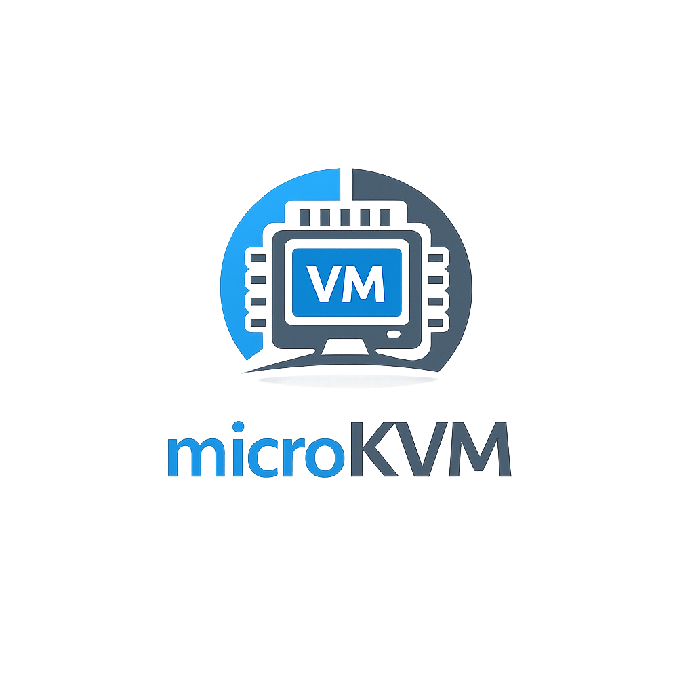

<p align="center"></p>

# microkvm

A step-by-step KVM-based hypervisor for learning virtualization internals.

microkvm is an educational hypervisor built directly on top of the Linux KVM API.

Each step introduces exactly one new virtualization concept, starting from a minimal guest that executes `hlt` and gradually evolving toward interrupts, MMIO devices, virtio, and live migration.
By step 11, microkvm boots a real Linux kernel and provides an interactive shell over an emulated 8250 serial console.

Each step is intentionally minimal and self-contained. Every VM exit can be traced and inspected.

Unlike production VMMs such as QEMU, microkvm intentionally prioritizes readability, traceability, and incremental learning over performance.

## What You Will Learn

- KVM ioctl workflow (`/dev/kvm` → VM → vCPU → `KVM_RUN`)
- VM exits and exit handling
- x86 CPU privilege modes (real → protected → long mode)
- x86 paging and identity-mapped page tables
- Interrupt delivery (IDT, interrupt gates, `iretq`)
- MMIO and device emulation
- Booting a real Linux kernel from a minimal VMM
- 8250 UART emulation (TX + RX with DLAB, IER, IIR, IRQ injection)
- Virtio internals (virtqueue, shared memory ring)
- Exit reduction (ioeventfd → irqfd → polling)
- Multi-vCPU synchronization
- Dirty page tracking and live migration mechanics
- PCI/MSI-X basics and hotplug

## Steps

Each step adds exactly one concept. Every step is tagged in git.

### Basics

| Step | Concept | What You Learn |
|------|---------|----------------|
| 1 | `hlt` execution | KVM API skeleton |
| 2 | I/O port character output | Exit handler loop |
| 3 | Real → protected mode | GDT, CR0, far jump |
| 4 | Protected → long mode (64-bit) | Page tables, CR3, CR4.PAE, EFER.LME |

### VM exits and device emulation

| Step | Concept | What You Learn |
|------|---------|----------------|
| 5 | MMIO write | MMIO emulation via guest physical address trap |
| 6 | MMIO read + device state | Bidirectional device model |
| 7 | Interrupt injection (IRQ) | KVM_INTERRUPT, IDT, iretq |
| 8 | MSR handling | TSC / synthetic MSR handling |

### Multi-vCPU and milestone

| Step | Concept | What You Learn |
|------|---------|----------------|
| 9 | Multiple vCPUs | pthreads + mutex |
| **10** | **★ Boot minimal Linux** | **bzImage + serial console + initramfs** |
| **11** | **★ Interactive shell** | **UART RX, host stdin → guest, busybox sh** |

### I/O data plane

| Step | Concept | What You Learn |
|------|---------|----------------|
| 12 | Virtio ring buffer | Shared memory data transfer |
| 13 | ioeventfd | Kernel-side PIO handling |
| 14 | irqfd | Kernel-side interrupt injection |

### Memory management

| Step | Concept | What You Learn |
|------|---------|----------------|
| 15 | Nested page fault measurement | Demand paging visualization |
| 16 | Dirty page tracking | KVM_GET_DIRTY_LOG |
| 17 | VM snapshot | Register + memory save/restore |
| 18 | Live migration | Iterative dirty page copy + stop-and-copy |

### Advanced virtualization internals

| Step | Concept | What You Learn |
|------|---------|----------------|
| 19 | DMA simulation | Host-to-guest direct memory write |
| 20 | Shared memory polling | Zero-exit communication |
| 21 | MSI-X emulation | MMIO table + vector selection + masking |
| 22 | PCIe hotplug | Slot control state machine + MSI-X notification |

## Navigating steps

Each step is tagged in git. To view the code at any step:

```bash
$ git checkout step1    # view Step 1 code
$ git checkout step5    # view Step 5 code
$ git checkout main     # return to latest
```

To see what changed between steps:

```bash
$ git diff step4..step5
```

## Building

```bash
$ make
$ ./microkvm
```

## Requirements

- Linux with KVM support (`/dev/kvm`)
- x86_64 CPU with VT-x (Intel) or SVM (AMD)
- GCC, GNU as, GNU ld

## License

MIT

## References

- [Using the KVM API (LWN)](https://lwn.net/Articles/658511/)
- [Linux KVM source](https://github.com/torvalds/linux/tree/master/arch/x86/kvm)