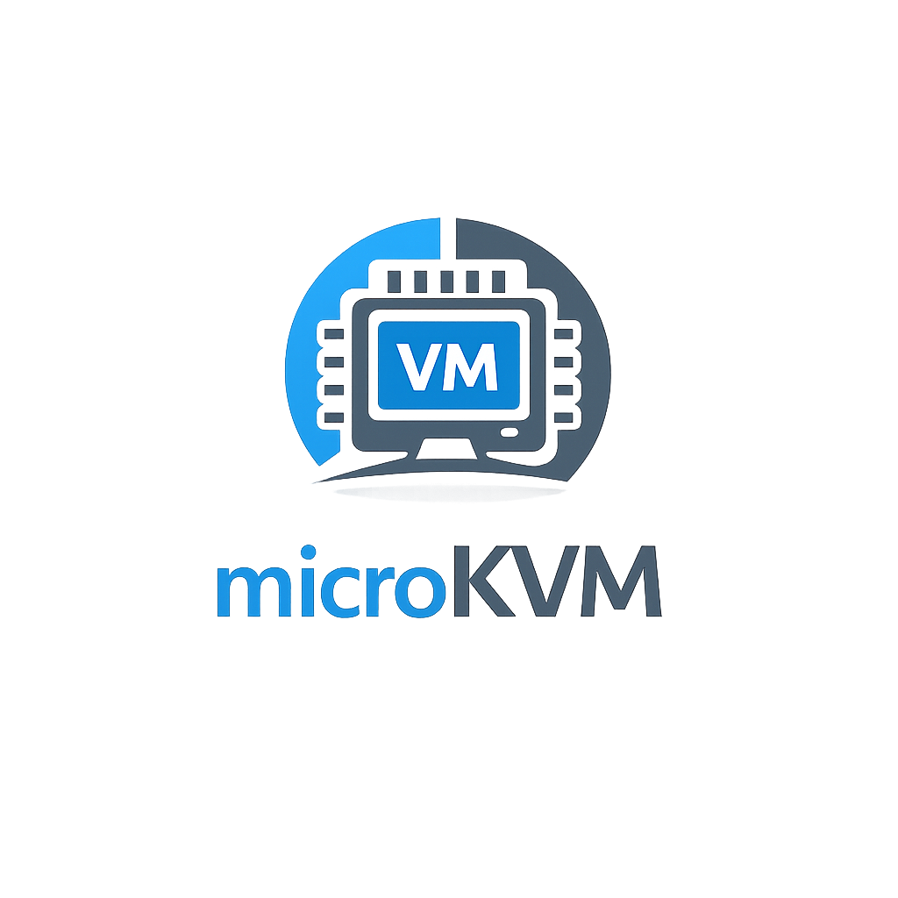

<p align="center"></p>

# microkvm

microkvm is a step-by-step educational VMM built directly on the Linux KVM API to learn virtualization internals.

Each step introduces exactly one new virtualization concept, starting from a minimal guest that executes `hlt` and gradually evolving toward a full Linux boot, virtio I/O, and live migration.
By step 11, microkvm boots a real Linux kernel and provides an interactive shell over an emulated 8250 serial console. From step 12 onward, the guest stays fixed and the VMM itself evolves - mirroring real-world hypervisor development.

Each step is intentionally minimal and self-contained. VM exits can be observed through KVM tracing and correlated with userspace-visible exits.

Unlike production VMMs such as QEMU, microkvm intentionally prioritizes readability, traceability, and incremental learning over performance.

## What You Will Learn

- KVM ioctl workflow (`/dev/kvm` → VM → vCPU → `KVM_RUN`)
- VM exits and exit handling
- x86 CPU privilege modes (real → protected → long mode)
- x86 paging and identity-mapped page tables
- Interrupt delivery (IDT, interrupt gates, `iretq`)
- MMIO and device emulation
- MSR handling (TSC, synthetic MSRs)
- Multi-vCPU with pthreads
- Booting a real Linux kernel from a minimal VMM
- 8250 UART emulation (TX + RX with DLAB, IER, IIR, IRQ injection)
- Virtio-mmio transport (device discovery, feature negotiation, virtqueue setup)
- Virtio-console (TX and RX via descriptor/avail/used rings)
- Exit reduction techniques (ioeventfd, irqfd)
- EPT/MMU internals and demand paging observation
- Dirty page tracking (`KVM_GET_DIRTY_LOG`)
- VM snapshot and restore
- Live migration (dirty logging, iterative pre-copy, downtime reduction)
- PCI Configuration Mechanism #1 (CF8/CFC port I/O)
- BAR probing and MMIO device register access
- DMA via descriptor ring and doorbell kick
- MSI-X interrupt delivery (`KVM_SIGNAL_MSI`)
- PCI hotplug (config-space visibility + sysfs rescan/remove)
- Linux PCI driver development (`pci_register_driver`, probe/remove lifecycle)
- BAR mapping from kernel space (`pci_iomap`, `readl`/`writel`)
- DMA from a Linux driver (`dma_alloc_coherent`, descriptor submission)
- MSI-X interrupt handling (`pci_alloc_irq_vectors`, `request_irq`)
- Follow VM exits through Linux KVM source code
- Trace KVM internals with ftrace and perf
- Understand VMCS, EPT, and VM-execution controls at the hardware-virtualization level

## Why microkvm?

QEMU is production-grade and feature-rich. microkvm intentionally trades completeness for readability. Each step introduces exactly one concept, making every VM exit and device interaction easy to trace and understand.

## Steps

Each step adds exactly one concept. Part 1 steps are code milestones and are tagged in git.
Part 2 is an observation/documentation phase and Part 3 mixes small observation tools with source-reading, so not every step has a tag.

## Part 1: Build a KVM-based VMM (Step 1–32)

**Part 1 is the build phase. Each step adds one working feature to the VMM, from a minimal `hlt` guest up to Linux boot, virtio I/O, live migration, and a PCI device with its Linux driver.**

### Phase A: Basics (Step 1–8)

| Step | Concept | What You Learn |
|------|---------|----------------|
| 1 | `hlt` execution | KVM API skeleton |
| 2 | I/O port character output | Exit handler loop |
| 3 | Real → protected mode | GDT, CR0, far jump |
| 4 | Protected → long mode (64-bit) | Page tables, CR3, CR4.PAE, EFER.LME |
| 5 | MMIO write | MMIO emulation via guest physical address trap |
| 6 | MMIO read + device state | Bidirectional device model |
| 7 | Interrupt injection (IRQ) | KVM_INTERRUPT, IDT, iretq |
| 8 | MSR handling | TSC / synthetic MSR handling |

### Phase B: Linux Boot (Step 9–11)

| Step | Concept | What You Learn |
|------|---------|----------------|
| 9 | Multiple vCPUs | pthreads + mutex |
| **10** | **★ Boot minimal Linux** | **bzImage + serial console + initramfs** |
| **11** | **★ Interactive shell** | **UART RX, host stdin → guest, busybox sh** |

> **Linux milestone**: From Step 12 onward, microkvm uses Linux as the guest.
> The focus shifts from extending `guest.S` to evolving the VMM itself.

### Phase C: Virtio and Exit Reduction (Step 12–18)

| Step | Concept | What You Learn |
|------|---------|----------------|
| 12 | virtio-mmio device discovery | MagicValue, DeviceID, VendorID, Linux probe |
| 13 | virtio feature negotiation | DeviceFeatures, DriverFeatures, status state machine |
| 14 | virtqueue setup | QueueSel, QueueNum, QueueReady, vring GPA |
| 15 | virtio-console TX | Guest → host via descriptor/avail/used ring |
| 16 | virtio-console RX | Host → guest + IRQ injection |
| 17 | ioeventfd | Kick exit elimination (kernel-side MMIO → eventfd) |
| 18 | irqfd | Interrupt exit elimination (eventfd → kernel-side injection) |

### Benchmark (tools/)

| Tool | What You Learn |
|------|----------------|
| ioeventfd/irqfd latency bench | Quantify exit elimination impact from Step 17–18 |

> Toggle `USE_IOEVENTFD=1` / `USE_IRQFD=1` to compare. See [docs/en/benchmark.md](docs/en/benchmark.md) for details.

### Phase D: Memory State Management (Step 19–23)

| Step | Concept | What You Learn |
|------|---------|----------------|
| 19 | KVM MMU stats explorer | EPT page-fault counters, demand paging observation |
| 20 | Dirty page tracking | `KVM_MEM_LOG_DIRTY_PAGES` + `KVM_GET_DIRTY_LOG` |
| 21 | VM snapshot | CPU, memory, UART, and virtio-mmio state restore (regs, sregs, FPU, MSRs, LAPIC, PIT, kvmclock) |
| 22 | Live migration (file) | Iterative pre-copy + stop-and-copy with downtime measurement |
| 23 | Live migration (socket) | TCP streaming, source/destination simultaneous execution |

### Phase E: PCI Device Model (Step 24–28)

| Step | Concept | What You Learn |
|------|---------|----------------|
| 24 | PCI config space + BAR | Configuration Mechanism #1 (CF8/CFC), BAR probing |
| 25 | PCI MMIO register device | BAR-based device register access |
| 26 | DMA simulation | Descriptor + doorbell, bidirectional data transfer |
| 27 | MSI-X emulation | PCI capability, MMIO vector table, KVM_SIGNAL_MSI |
| 28 | PCI hotplug simulation | Config-space visibility toggle + sysfs rescan/remove |

### Phase F: Linux PCI Driver (Step 29–32)

| Step | Concept | What You Learn |
|------|---------|----------------|
| 29 | Minimal PCI driver | `pci_register_driver`, `probe/remove`, vendor/device ID match |
| 30 | BAR mapping | `pci_enable_device`, `pci_request_regions`, `pci_iomap`, `readl`/`writel` |
| 31 | DMA-capable driver | `dma_alloc_coherent`, DMA address, descriptor submission via doorbell |
| 32 | MSI-X interrupt handler | `pci_alloc_irq_vectors`, `request_irq`, completion handling |

> **Driver milestone**: Phase E built the VMM-side PCI device model.
> Phase F builds the Linux guest-side driver for the same virtual PCI device.
> Together they demonstrate both sides of a device virtualization stack: the device model in the VMM and the driver inside the guest kernel.

## Part 2: Understand KVM Through VM Exits (Step 33–40)

**Part 2 is an observation phase. It does not add VMM features; the deliverables are traces, source-reading notes, and behavioral explanations comparing microkvm with Linux KVM.**

| Step | Concept | What You Learn |
|------|---------|----------------|
| 33 | Observe VM exits | perf kvm, exit statistics, frequency |
| 34 | Analyze VM exits | Latency distribution, pattern classification |
| 35 | Trace KVM internals | ftrace, KVM tracepoints |
| 36 | The KVM exit pipeline | VM Entry → Guest → VM Exit → vmx_handle_exit() → dispatch → handler → VM Entry |
| 37 | IRQ exit | How KVM delivers interrupts (LAPIC, posted interrupts) — cf. Step 7 |
| 38 | MMIO exit | How KVM handles MMIO-related faults and emulation paths — cf. Step 5 |
| 39 | MSR exit | How KVM uses MSR bitmap and emulation — cf. Step 8 |
| 40 | CPUID exit | How KVM handles and virtualizes guest CPUID |

## Part 3: Understand Hardware Virtualization (Step 41–43 + Capstone)

**Part 3 explores VT-x through the interfaces KVM already exposes. KVM itself is not modified; VMCS/EPT behavior is observed indirectly through KVM APIs and tracepoints, then correlated with KVM source and the Intel SDM.**

| Step | Topic | What You Learn |
|------|-------|----------------|
| 41 | VM entry/exit state | Correlate KVM-visible guest state with VMCS state and understand the observation boundary |
| 42 | EPT and guest memory | Trace GPA → memslot → host backing and observe RAM faults vs MMIO behavior |
| 43 | VM-execution controls | Explain why CPUID, HLT, and RDMSR cause VM exits using three interception models |
| Capstone | RDMSR 0x1b end-to-end | Follow one instruction across guest → VMX → KVM → guest and explain why `KVM_RUN` does not return to userspace for that exit |

## Navigating Steps

Part 1 code milestones are tagged in git:

```bash
$ git checkout step01   # view Step 1 code
$ git checkout step11   # view Linux boot milestone
$ git checkout step18   # view exit reduction (ioeventfd + irqfd)
$ git checkout step23   # view socket-based live migration
$ git checkout step28   # view PCI hotplug
$ git checkout step32   # view Linux PCI driver (MSI-X)
$ git checkout step41   # view KVM-visible guest state dump
$ git checkout step42   # view memory slot explorer
$ git checkout main     # return to latest
```

To see what changed between steps:

```bash
$ git diff step20..step21   # what snapshot added
```

Some steps in Part 2 and Part 3 do not add VMM features. They are observation and source-reading, and their write-ups live under `docs/` rather than a git tag.

## Building

```bash
$ make
$ ./microkvm
```

For Phase B+ (Linux boot), place `bzImage` and `initramfs.gz` in the same directory:

```bash
$ ./microkvm                                    # boot Linux
$ ./microkvm --restore snapshot.bin             # restore from snapshot  (Step 21)
$ ./microkvm --restore-migration migration.bin  # restore from migration (Step 22)
$ ./microkvm --incoming tcp:4444                # receive live migration (Step 23, socket dest)
```

## Monitor Commands

While the guest is running, microkvm provides several monitor commands prefixed with `Ctrl-A`:

| Key | Action |
|-----|--------|
| `Ctrl-A v` | Toggle input between ttyS0 (UART) and hvc0 (virtio-console) |
| `Ctrl-A d` | Print dirty page report |
| `Ctrl-A s` | Save VM snapshot |
| `Ctrl-A m` | Start live migration (file-based) |
| `Ctrl-A t` | Start live migration (socket-based, connects to destination) |
| `Ctrl-A h` | Toggle PCI hotplug device |
| `Ctrl-A p` | Print KVM-visible guest state |
| `Ctrl-A e` | Explore memory slots: GPA → slot → backing VA |

## Requirements

- Linux with KVM support (`/dev/kvm`)
- x86_64 Linux host. Part 3 specifically follows Intel VT-x/VMX terminology (VMCS, EPT, VM-execution controls) and expects an Intel VT-x-capable host for direct correspondence with the documented flow.
- GCC, GNU Make
- `bzImage` + `initramfs.gz` for Step 10+

## Out of Scope

Direct VMCS/EPT instrumentation, execution-control mutation, and a standalone VMX implementation are intentionally outside microkvm's completed learning path.

## License

Released under the [MIT License](LICENSE).

## References

- [Using the KVM API (LWN)](https://lwn.net/Articles/658511/)
- [Linux KVM source](https://github.com/torvalds/linux/tree/master/arch/x86/kvm)
- [Virtio specification v1.2](https://docs.oasis-open.org/virtio/virtio/v1.2/virtio-v1.2.html)
